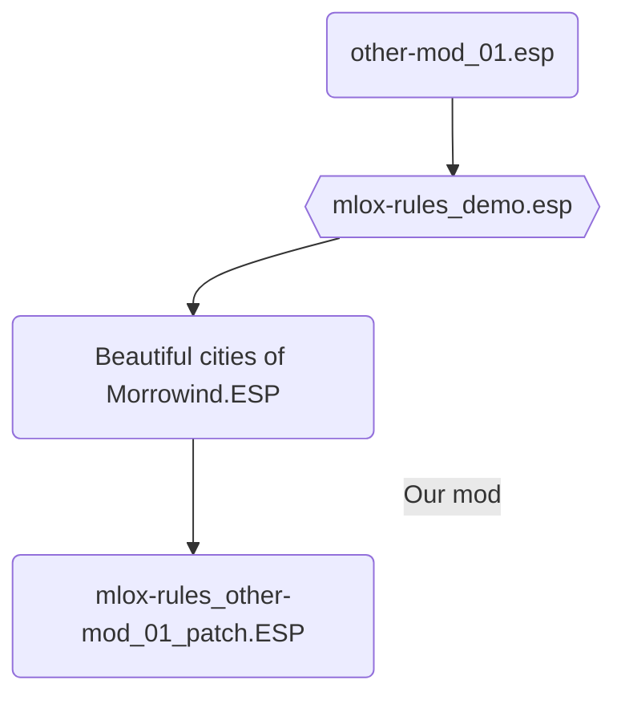

>[!abstract]- Pages contained within this folder 
>
>This article is part of a series on [[Modding Tools/Sorting Plugin Load Order/Mlox/index|mlox]]
> 
>* [[Contributing to mlox Rules]] -- How to contribute to the rule-base of mlox 
>* [[Tutorial - How to Add Rules to the mlox-rules Repository]]
>* [[mlox Rule Guidelines]] -- Guidelines for Editors of the mlox rule-base
>* [[Building mlox]] -- Creating your own build of mlox
>* [[mlox History]] -- A brief history of the development of mlox 

*This page is a tutorial on how to create your first mlox rules and commit them to the Github repository*

For more information on how to contribute to [mlox-rules](https://github.com/DanaePlays/mlox-rules), see [[Contributing to mlox Rules]]

# Tutorial

>[!info] Scenario:
> ![[Tools_mlox_contributing_Nexus1.png]] 
> 
> **Scenario:**
> 
> For the purposes of this tutorial, we will use a fictional Nexus mod page -- **'Morrowind Modding Wiki - Contributing to mlox Rules'**, which contains the ESP `mlox-rules_demo.esp`.
> 
> It also contains the patch ESP `mlox-rules_other-mod_01_patch.ESP` for the fictional mod  `other-mod_01.esp`.
> 
> Follow the tutorial to find out how to create `[order]` and `[conflict]` mlox rules for this mod, then contribute these to the repository.

>[!abstract] Tutorial Requirements and Files

* **Difficulty**: #Beginner 
* **Requirements**: 
 	* A Github account
 	* A decent text editor -- *Windows Notepad is all that is required, but [Visual Studio Code](https://code.visualstudio.com/) is recommended, especially for its [Git](https://git-scm.com/) integration*

## Step One: Find a rule to add
Referring to the demo mod page, we can see that it stipulates load order requirements and also which mods conflict with it:

>[!figure] ![[Tools_mlox_contributing_Nexus2.png]]
> 
> An example of how a mod's load order requirements and conflicts might be displayed on a NexusMods page.

`mlox-rules_demo.esp` is our fictional mod's ESP. 

