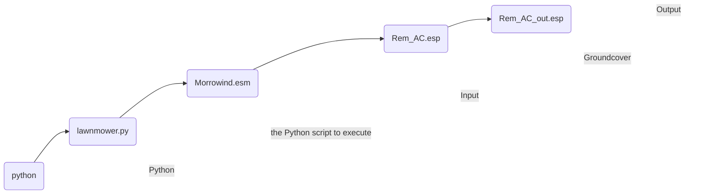
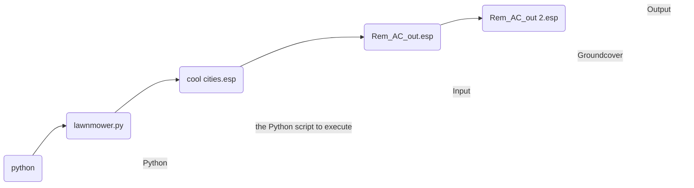

## About

> [!infobox|n-th]
> 
> ## Lawnmower Groundcover Tutorial
> 
> ![[lawnmower-for-morrowind-logo.webp|center]]
> 
> ### Tutorial Info
> 
> | Type | Name |
> | --- | --- |
> | **Requirements** | - [The Lawnmower](https://www.nexusmods.com/morrowind/mods/53034)<br>- [Tes3conv](https://github.com/Greatness7/tes3conv)<br>- [Python 3.5 or later](https://www.python.org/)<br>- [Tes3cmd](https://modding-openmw.com/mods/tes3cmd/) (optional)<br>- [TESTool](https://www.nexusmods.com/morrowind/mods/47473) (optional) |
> | **Tutorial Files** | Any groundcover plugin you like that has not already had Lawnmower ran on it (the mod description will likely state whether this is the case) |

This tutorial covers how to use [[the-lawnmower|The Lawnmower]] tool to clean [[guides/groundcover/index|groundcover]] mods of excess grass - specifically, grass which clips through or is hidden under other objects.

![[the-lawnmower#^2eccab|clean]]

However, for the purposes of this tutorial we will only be focusing on the titular **Lawnmower**. 

### Goals

By the end of this tutorial, you should be able to:

1. Run `lawnmower.py` Python script on a groundcover plugin
2. Compare a groundcover plugin against multiple mods ('chaining')
3. Understand how to use the 'autoclean' plugins to increase the accuracy of The Lawnmower
4. Clean the patched groundcover plugin

### Prerequisites

> [!Info|right wm-sm txt-s] Installing Python
> Whilst it may seem daunting, installation is unremarkable on most platforms.[^1] 
> 
> See Python [BeginnersGuide / Download](https://wiki.python.org/moin/BeginnersGuide/Download) for help.

In addition to downloading The Lawnmower (tools only), the tool also requires that you have [Tes3conv](https://github.com/Greatness7/tes3conv) and [Python](https://www.python.org/) installed.

Copy `tes3conv.exe` to your Morrowind `Data Files` folder, or install it using a mod manager.

Likewise, copy `lawnmower.py` from The Lawnmower to `Data Files` or install it with a mod manager. 

## Running the Script



`lawnmower.py` is a Python script. To run it, open a command-line terminal (e.g., Windows Powershell) and enter `python lawnmower.py`, followed by three plugin names:

1. **Input**: The plugin to compare the groundcover against, e.g., `Morrowind.esm`.
2. **Groundcover mod**: The groundcover plugin Lawnmower will trim, e.g., `Rem_AC.esp`
3. **Output**: The name you give to the trimmed groundcover mod, e.g., `Rem_AC_out.esp`
	- Output can be named anything you like, as long as it ends with the extension `.esp` or `.esm`, e.g., `trimmed_mod.esm`.

This would be entered as:

```
python lawnmower.py Morrowind.esm Rem_AC.esp Rem_AC_out.esp
```

Press <kbd>Enter</kbd> to execute the script, and Lawnmower will create the freshly trimmed groundcover plugin '`Rem_AC_out.esp`'.

## Running Lawnmower Against Mutiple Plugins

Also known as 'Chaining' - The steps taken above in [[lawnmower-tutorial#Running the Script|'Running the Script']] can be repeated by substituting different input plugins.

For example, if you add a city overhaul mod which adds numerous buildings to cities (e.g., `cool cities.esp`, and you wish for your previous `Rem_AC_out.esp` to be trimmed of grass clipping through the new buildings, the command can be formatted like so:

```
python lawnmower.py "cool cities.esp" Rem_AC_out.esp "Rem_AC_out 2.esp"
```



This can be repeated for any plugins you wish to compare the groundcover against, and even turned into a <abbr title="Batch File">BAT file</abbr> to be reused.

> [!tip|txt-s] Using Lawnmower with your Entire Mod-List
> Some tools for [[modding-tools/merging-plugins/index|merging plugins]], such as [[habasi|Habasi]], can generate a single merged plugin of your entire mod list. This merged plugin can be used as the `input` plugin for Lawnmower, saving you the trouble of running the script on individual mods.
> 
> To generate a merged plugin with **Habasi**, run the command `habasi -O` in a terminal.

## Utilizing Autoclean Plugins

Autoclean plugins can be used to increase the accuracy of Lawnmower in detecting clipping groundcover.

Lawnmower comes packaged with two autoclean plugins:

- `autoclean_cities_vanilla.esp`: &nbsp; For Vvardenfell cities
- `autoclean_cities_TR.ESP`: &nbsp; For [Tamriel Rebuilt](https://www.tamriel-rebuilt.org/) cities

These plugins utilize the invisible marker meshes from [[the-lawnmower#Grassblocker|Grassblocker]], which `lawnmower.py` treats as objects when detecting whether grass is clipping. The plugins place these meshes in common areas where unwanted grass is often generated by [[mesh-gen|Mesh Generator]], but which otherwise won't be detected by `lawnmower.py` unless an object covers the area - i.e., a Grassblocker mesh. Mod makers can also create Lawnmower autoclean patches for their own mods using Grassblocker.

The syntax for cleaning a groundcover plugin with an autoclean plugin is the same as any other:

```
python lawnmower.py autoclean_cities_vanilla.esp "my grassmod.esp" "my grassmod_out.esp"
```

## Advanced - Cleaning the Plugin

The caveat to The Lawnmower is that it does not truly delete the grass references it detects.

Instead, it moves their coordinates to `X: 0`, `Y: 0`, `Z: -20,000`, far below the surface of the game world. As groundcover plugins contain tens of thousands of references, these moved references are still taking up file space, even if they are never encountered in-game. Deleting these will not improve performance markedly, but it can make analyzing the output plugin easier.

With a couple of extra steps, the reference count of the output plugin can be greatly reduced.

> [!Note|txt-s right wm-sm] Note on Performance Impact 
> Deleting the references likely will not offer any noticeable performance gain, beyond marginally improving plugin load speed upon launching the game. 
> 
> However, it does make it easier to analyze the output plugin later by removing redundant data, for example:
> 
> - Viewing modified cells in [[CSSE]] or [[modding-tools/low-level-editors/index|low-level editors]]: Cells containing only grass moved by Lawnmower will no longer appear as modified.
> - Viewing a text representation of the plugin created by Tes3cmd `dump`, Tes3conv JSON or [[deltaplugin|DeltaPlugin]] YAML: Cleaning the plugin 'declutters' it so redundant data does not clutter the results.

Cleaning the output plugin of redundant `CELL` references involves two steps:

1. Delete the moved grass with [[tes3cmd|Tes3cmd]].
2. Clean the plugin of any empty cells with [[testool|TESTool]].

The second step is useful for instances where Lawnmower has removed all grass from a cell, leaving an empty `CELL` record.

### Step 1 - Tes3cmd

Thankfully, the moved references have one unique thing in common: their coordinates have all been moved to `Z: -20,000`.

The following Tes3cmd `delete` command will delete all the moved references:

```tile="tes3cmd 'delete' command"
tes3cmd delete --instance-match "Z\:-20000" <path-to-plugin>
```

Replace `<path-to-plugin>` with your plugin name.

### Step 2 - TESTool

TESTool can clean empty cells which are otherwise not considered by Tesecmd as 'junk cells'.

Simply run TESTool `Clean ESP/ESM files` on the output plugin.

## Further Reading

- [[the-lawnmower|The Lawnmower]]
- [[mesh-gen|Mesh Generator]]
- [[habasi|Habasi]]

[^1]: "Python for Beginners: Installing", Python.org, accessed August 24, 2024, https://www.python.org/about/gettingstarted/